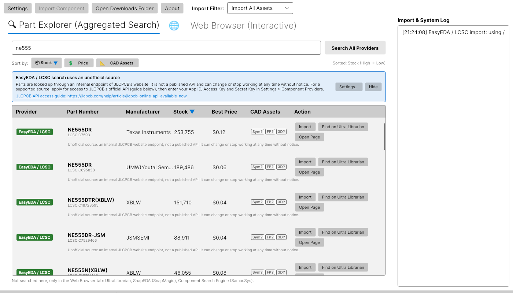

<h1 align="center">
  <br>
  kicad-ultra
</h1>

<h4 align="center">Search for a part and get its symbol, footprint and 3D model into your KiCad project, without leaving KiCad.</h4>

<p align="center">
  <a href="https://github.com/danielmeza/kicad-ultra/actions/workflows/ci.yml"></a>
  <a href="LICENSE"></a>
  <a href="https://github.com/danielmeza/kicad-ultra/issues"></a>
  
</p>

<p align="center">
  <a href="#what-it-does">What it does</a> •
  <a href="#install">Install</a> •
  <a href="#quick-start">Quick start</a> •
  <a href="docs/README.md">Docs</a> •
  <a href="#troubleshooting">Troubleshooting</a> •
  <a href="#status">Status</a>
</p>

<p align="center">
  
</p>

Adding a part to a KiCad project usually means leaving it: search a vendor site, download a zip,
unpack it somewhere, add two library-table rows by hand, and hope the 3D model still points at a path
that exists. kicad-ultra does that from inside KiCad.

## What it does

- **Searches several sources at once.** EasyEDA / LCSC parts from JLCPCB's library, and Octopart
  through Nexar with your own token. Results stream in as each source answers, with stock, price
  breaks and the datasheet. See [where the parts come from](docs/data-sources.md).
- **Imports two ways.** A result with an LCSC code converts through
  [easyeda2kicad](https://github.com/uPesy/easyeda2kicad.py). Any result with a manufacturer part
  number gets **Find on Ultra Librarian**, which opens that search in the built-in browser tab, where
  the download you make is intercepted and imported.
- **Registers the library for you.** Symbol, footprint and 3D model go into one library, added to the
  project's `sym-lib-table` and `fp-lib-table` with `${KIPRJMOD}`-relative paths, or to KiCad's global
  tables when no project is open. Rows already there are left byte for byte as they were.
- **Says what it actually knows.** CAD availability is yes, no or **unknown** — never a guess. Each
  row names its source. A provider that fails is reported as failed, never as "no results".
- **Re-imports cleanly.** Importing a part again replaces its symbol, footprint and model instead of
  leaving duplicates, and a failed or cancelled import rolls back and registers nothing.
- **Serves an MCP server.** Started with `--mcp` it exposes three read-only tools over stdio so an AI
  client can look parts up. It never imports, and never uses JLCPCB's official API.

## Install

> [!NOTE]
> A Plugin and Content Manager package that fetches the application for you is being built in
> [#128](https://github.com/danielmeza/kicad-ultra/issues/128). Until then it is a manual install: the
> application is a 450 MB self-contained build, 340 MB of it the embedded browser, which is why it
> does not live inside the plugin package.

```sh
# 1. build the application into the plugin's bin/ (use win-x64, osx-x64 or osx-arm64 elsewhere)
dotnet publish src/importer/UltraLibrarianImporter.UI/UltraLibrarianImporter.UI.csproj \
    -c Release -r linux-x64 --self-contained true -o plugin/bin

# 2. put plugin/ where KiCad looks — on Linux, for a native install:
ln -s "$PWD/plugin" ~/.local/share/kicad/10.0/3rdparty/plugins/kicad-ultra
```

Then **Preferences → Plugins → Enable IPC API** and restart KiCad. The other platforms' directories,
the Flatpak, and the optional easyeda2kicad are in [Installing](docs/installing.md).

Needs KiCad 10 (9.0 has the IPC API but is untested here) and, to build it, the
[.NET 10 SDK](https://dotnet.microsoft.com/).

## Quick start

1. Open **Import from UltraLibrarian** in KiCad, with your project open.
2. Type a part number or a keyword in the **Part Explorer** and press **Search All Providers**.
3. On a row with an LCSC code press **Import**. On any other row press **Find on Ultra Librarian**,
   sign in there and download the KiCad model — the download is intercepted and imported.
4. Reopen the project, or restart KiCad, so it re-reads the library tables. Place the part.

**Settings → General → Register imported libraries in** chooses which table gets the library:
**Automatic** (the project's when one is open, KiCad's global one when not), **Project** or
**Global**.

## Documentation

| Page | What's in it |
|---|---|
| [Installing](docs/installing.md) | Every platform, the Flatpak, easyeda2kicad, and where settings, logs and credentials live |
| [Where the parts come from](docs/data-sources.md) | Each source and what it needs, JLCPCB's two routes, CAD availability, attribution and trademark rules |
| [Troubleshooting](docs/troubleshooting.md) | The full list, beyond the three below |
| [Building and testing](docs/building.md) | Build gates, running it during development, building against local library checkouts |
| [CLAUDE.md](CLAUDE.md) | The deeper guide: architecture, every build constraint, and the traps already paid for |

## Troubleshooting

<details>
<summary>The Import button is disabled</summary>

Hover it: the tip says why. Usually easyeda2kicad is not installed, or the row carries no LCSC code —
use **Find on Ultra Librarian** on that row instead. **Settings → Component Providers →
easyeda2kicad** shows what was found and where it looked.

</details>

<details>
<summary>The imported part does not show up in KiCad</summary>

KiCad reads the library tables when a project opens and does not re-read them on its own. Reopen the
project, or restart KiCad. The import log names the table it wrote to.

</details>

<details>
<summary>The About window does not say "Connected"</summary>

"Not connected" means nothing is listening: check **Preferences → Plugins → Enable IPC API**. "KiCad
is busy" means a modal dialog owns KiCad's main loop — the stale lock-file prompt is the usual one.
Started by hand rather than by KiCad, the app looks for KiCad's socket under its own `TMPDIR`.

</details>

The rest, including rate limiting and where the logs are, is in
[Troubleshooting](docs/troubleshooting.md).

## Status

**Early, and developed in the open.** The import path works end to end and is verified; the polish
around it is still moving, and the open issues say what each one waits on.

Verified on 2026-09-22 against running KiCad instances, **10.0.6** and **10.99** (the KiCad 11 line):
connect, search, import an LCSC part, register it in the project's tables, and `kicad-cli` loads the
resulting symbol and footprint on both.

What it does not do yet:

- **The KiCad GUI has not been driven end to end.** The import path is verified with `kicad-cli` and
  over IPC against a running KiCad, not by clicking through the editors.
- **Windows and macOS build but are unverified.** Every runtime check so far is Linux.
- **Symbols, footprints and 3D models only** — no simulation models, and datasheets are not attached
  to imported parts ([#73](https://github.com/danielmeza/kicad-ultra/issues/73)).
- **Registration edits the table files.** KiCad 11 declares IPC commands for it but does not answer
  them yet — [measured, not assumed](https://github.com/danielmeza/kicad-ultra/issues/72#issuecomment-5788030778).
- **SnapEDA and SamacSys are browser-only**; neither publishes an API a desktop app may use.

## Contributing

Issues and pull requests are welcome. A good bug report carries the log lines around the failure and
the KiCad version from the About window. [CLAUDE.md](CLAUDE.md) is worth reading first — it is the
guide this repository is actually developed against, including the build gates.

Two rules that are not style preferences:

- **Never fabricate data.** A result, a price or a CAD-availability flag appears only because a source
  said so. A provider that cannot answer is left out, and a failure is reported as a failure.
- **Name a supplier only to identify where data comes from.** JLCPCB's API terms forbid its trademark
  or logo in a partner's advertising and "JLC" in a partner's URLs, and breaking them ends API access
  ([#58](https://github.com/danielmeza/kicad-ultra/issues/58)). The details are in
  [Where the parts come from](docs/data-sources.md#trademarks-and-attribution).

## Credits and license

- Built with [.NET 10](https://dotnet.microsoft.com/), [Avalonia](https://avaloniaui.net/),
  [CommunityToolkit.Mvvm](https://github.com/CommunityToolkit/dotnet),
  [ReactiveUI](https://www.reactiveui.net/), [CefGlue](https://github.com/OutSystems/CefGlue) and
  [WebViewControl-Avalonia](https://github.com/OutSystems/WebView), [NLog](https://nlog-project.org/),
  and this project's own [SExpressions](https://github.com/danielmeza/sexpressions) and
  [KiCadSharp](https://github.com/danielmeza/kicad-sharp).
- [easyeda2kicad](https://github.com/uPesy/easyeda2kicad.py) is © its authors under AGPL-3.0: a
  separate program you install, not a part or a dependency of this project.
- UltraLibrarian, EasyEDA, LCSC, JLCPCB, Octopart, Nexar, SnapEDA and SamacSys are trademarks of their
  owners, named only to identify the services this plugin works with. This project is not affiliated
  with or endorsed by any of them.
- Released under the [MIT License](LICENSE).
